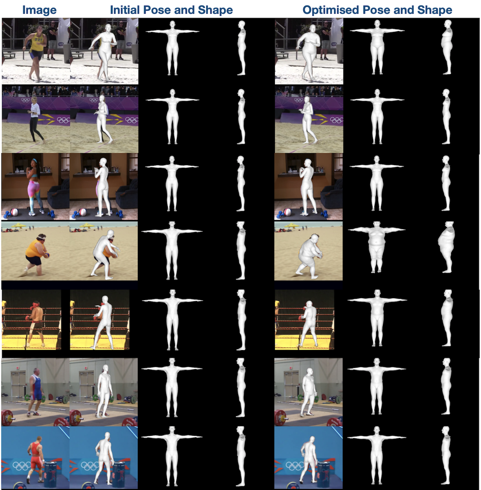

# SSP-3D
Repository for the Sports Shape and Pose 3D (SSP-3D) dataset, as introduced in "Synthetic Training for Accurate 3D Human Pose and Shape Estimation in the Wild". 

## Description
SSP-3D is an evaluation dataset consisting of 311 images of sportspersons in tight-fitted clothes, with a variety of body shapes and poses. It is intended for use as a benchmark for body **shape** prediction methods. Pseudo-ground-truth 3D shape labels (using the SMPL body model) were obtained via multi-frame optimisation with shape consistency between frames (as described in the paper above). The figure above shows a few samples from the SSP-3D dataset (under 'Optimised Pose and Shape') as well as a comparison with pre-optimised body predictions (using [VIBE](https://github.com/mkocabas/VIBE)), which demonstrates the improvement in body model fit achieved using optimisation.

## Data
Since SSP-3D is a small dataset, the zip file containing all the necessary data is a part of this repository. Unzipping it will reveal a folder with images, a folder with silhouette annotations and a file called `labels.npz`. This file contains arrays with filenames, SMPL pose parameters, SMPL shape parameters, genders, 2D joint annotations, camera translations and bounding boxes for each image.

## Code
We provide a python3 script `visualisation.py` that demonstrates how to project/render/visualise all the relevant data. To run the script, you will need to install the relevant libraries: `pip install requirements.txt`. If you have trouble install `pyrender`, please take a look at the [docs](https://pyrender.readthedocs.io/en/latest/install/index.html).

Additionally, please download the [SMPL male and female models](http://smpl.is.tue.mpg.de). You will need to convert the SMPL model files to be compatible with python3 by removing any chumpy objects. To do so, please follow the instructions [here](https://github.com/vchoutas/smplx/tree/master/tools). Rename the models to `SMPL_MALE.pkl` and `SMPL_FEMALE.pkl`. Finally, set `SSP_3D_PATH` in `config.py` to the SSP-3D root directory path. Set `SMPL_MODEL_DIR` to the path of the directory with the SMPL models.

After completing set-up, run `python visualisation.py`.

## Metrics
This dataset is intended for use as a body shape evaluation benchmark. If you decide to use this dataset, we recommend you report the following metrics:
- mIOU: mean Intersection-over-Union between target silhouette and predicted SMPL silhouette.
- PVE-T-SC (mm): per-vertex error in a neutral pose (T-pose) after after scale-correction (to account for scale vs camera depth ambiguity). An example of how to compute this metric given predicted in `metrics.py`.
